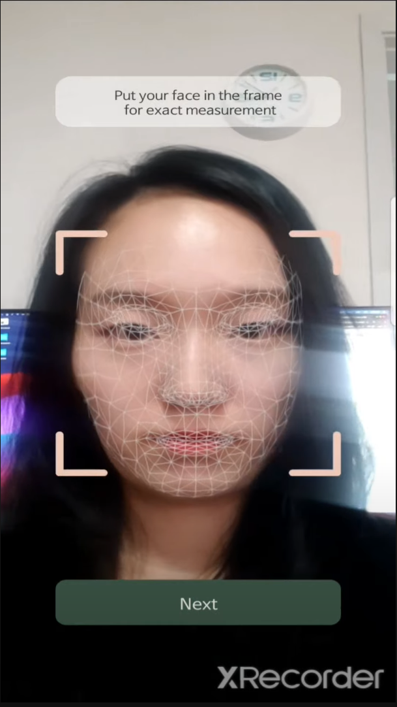
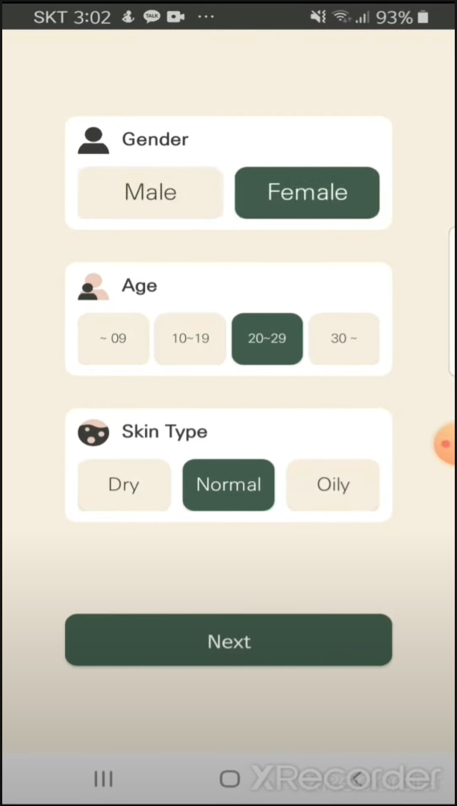
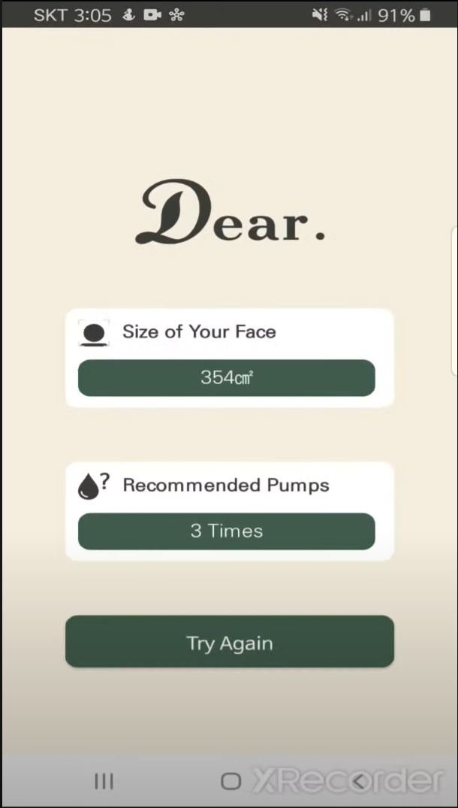
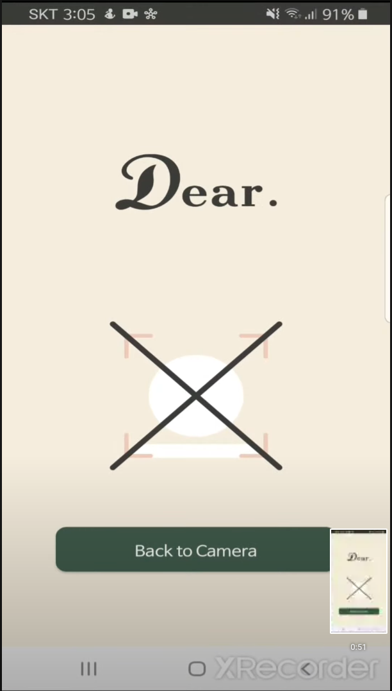
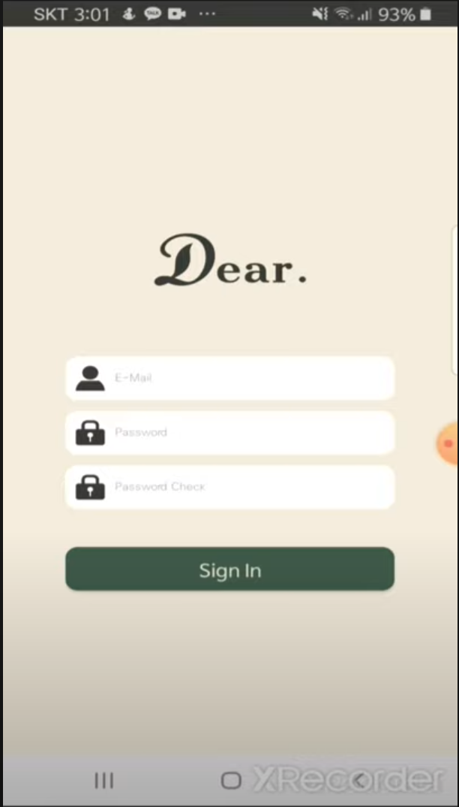
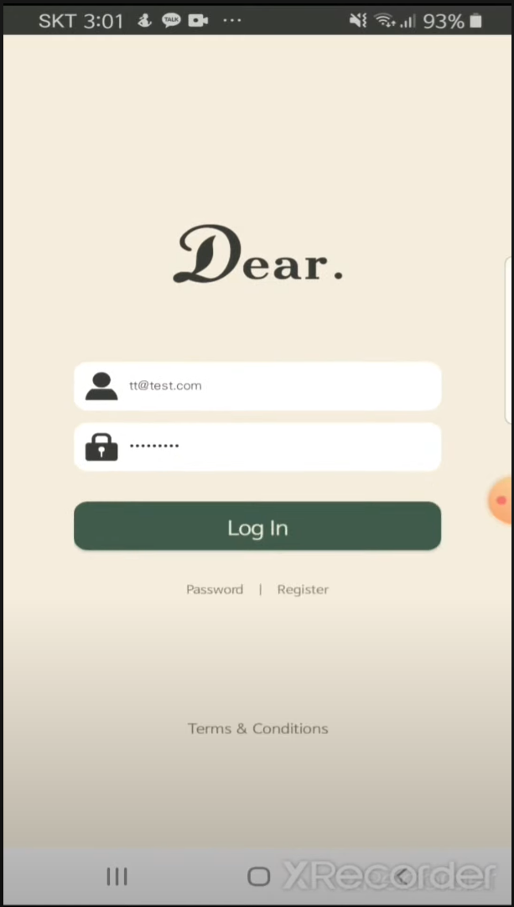

### 화사 프로젝트 by 나인와트

# ar 얼굴 인식 및 얼굴 사이즈 측정 앱

## 소개

- 개발기간 : 6주 (기여도 100%)
- 전면 카메라의 AR과 머신러닝으로 얼굴을 인식하여 얼굴의 크기를 측청해주고, 화장품 사용량을 알려주는 앱입니다.
- 연구 과제 어플로 출시는 안했습니다.
- [시연 영상 보기](https://www.youtube.com/watch?v=NxpMWFNSFqM) 👀

## 구현기술

- 언어 : Java
- 운영체제 : Android OS
- API/라이브러리 : Firebase, Google ML Kit

## 기능

### 1. Google ML Kit과 AR Core로 얼굴 인식 후 가면 씌우는 화면

### 2. 유저 얼굴 정보 입력

### 3. 인식 성공 화면

### 4. 인식 실패 화면

### 5. 회원가입(firebase 연동)

### 6. 로그인(firebase 연동)

