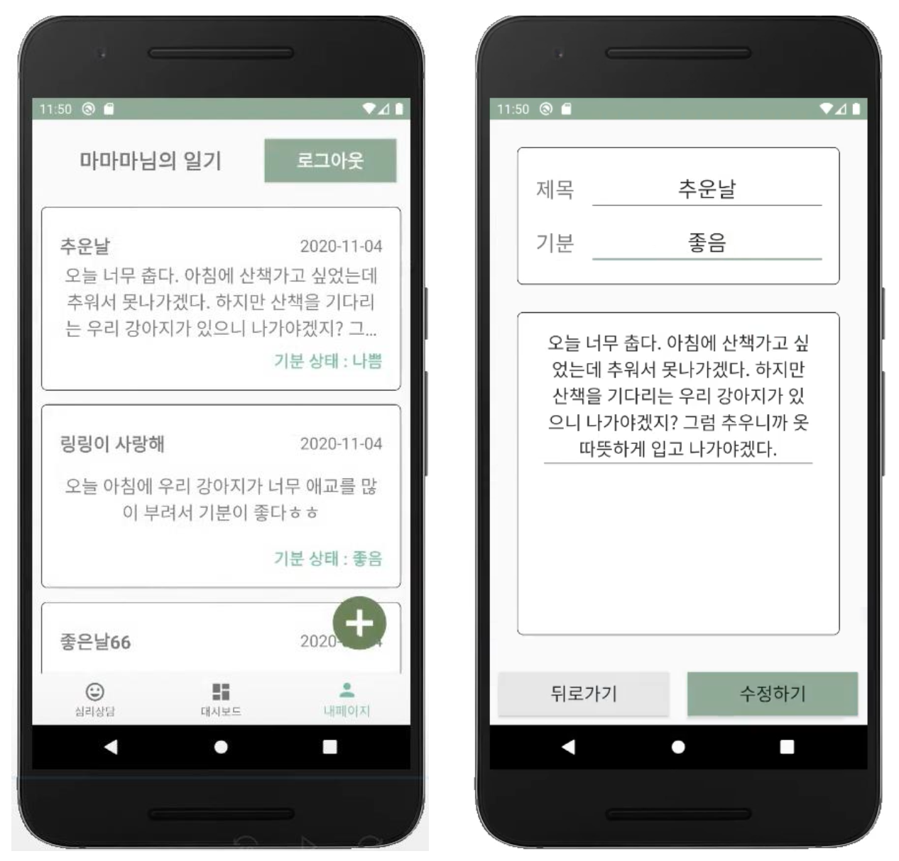

### SW 개발 개인 프로젝트

# 마음알림

## 소개

- 개발기간 : 8주 (기여도 100%)
- ‘2020년 청소년상담복지사업 국민아이디어 공모전’ 을 계기로 청소년 상담 채팅 서비스를 기획했고, 그 서비스 아이디어를 실제로 구현해 본 작품이 청소년 상담 어플 ‘마음알림’입니다.
- [시연 영상 보기](https://youtu.be/9dNp8FtCwFk) 👀

## 구현기술

- 기술스택 : Java, Html, Css, Javascript, PHP
- 웹서버 : Apache
- 데이터베이스 : MySQL
- 운영체제 : Ubuntu, Android OS
- 프로토콜 : HTTP, TCP/IP, SFTP, SSH
- API/라이브러리 : Volly, HttpURLConnection, IBM Watson, Gson

## 기능

### 1. 상담 내담자 화면 : 챗봇을 통한 상담 접수

### 2. 상담사 화면 : 상담 접수 내역 실시간 확인

### 3. 상담 내담자 & 상담사 : 실시간 채팅

### 4. 상담사 화면 : 상담내용 요약 정리 및 제출 / 저장 내용 확인

### 5. 상담사 화면 : 마이페이지 → 상담 기록 보관

### 6. 상담 내담자 화면 : 대시보드 포스트

### 7. 상담 내담자 화면 : 내 상담 기록 게시물 삭제

### 8. 상담 내담자 화면 : 챗봇 일기 작성

### 9. 상담 내담자 화면 : 챗봇 일기 수정 및 삭제

### 10. 회원가입 및 로그인

