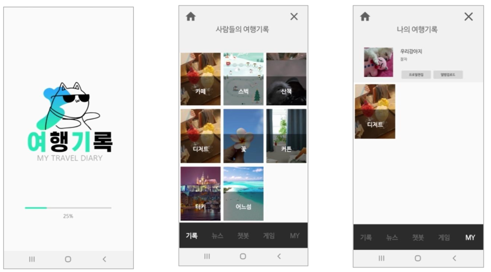
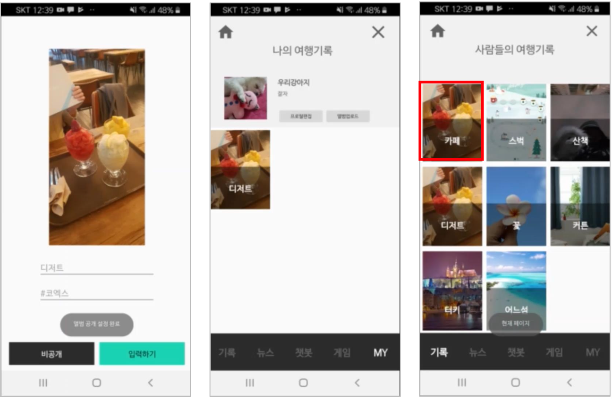
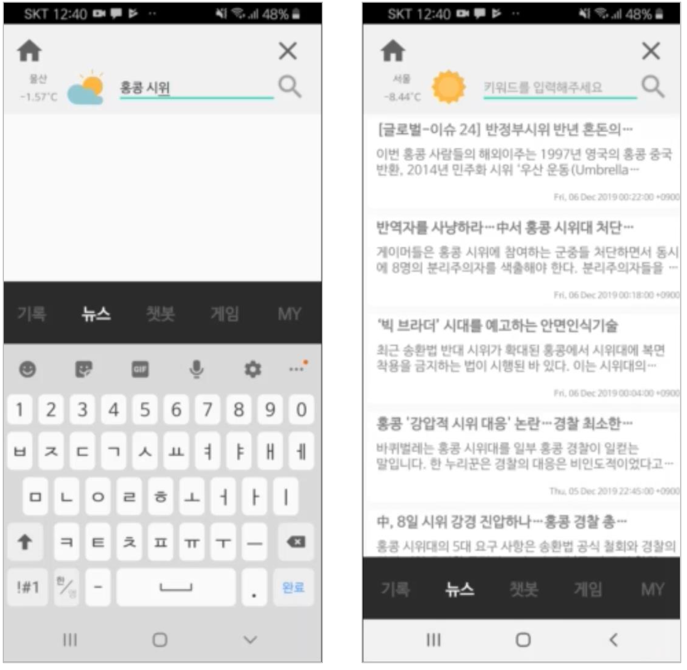
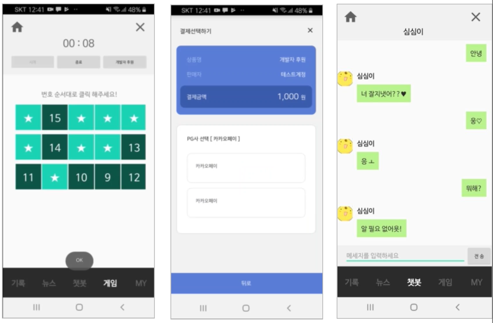
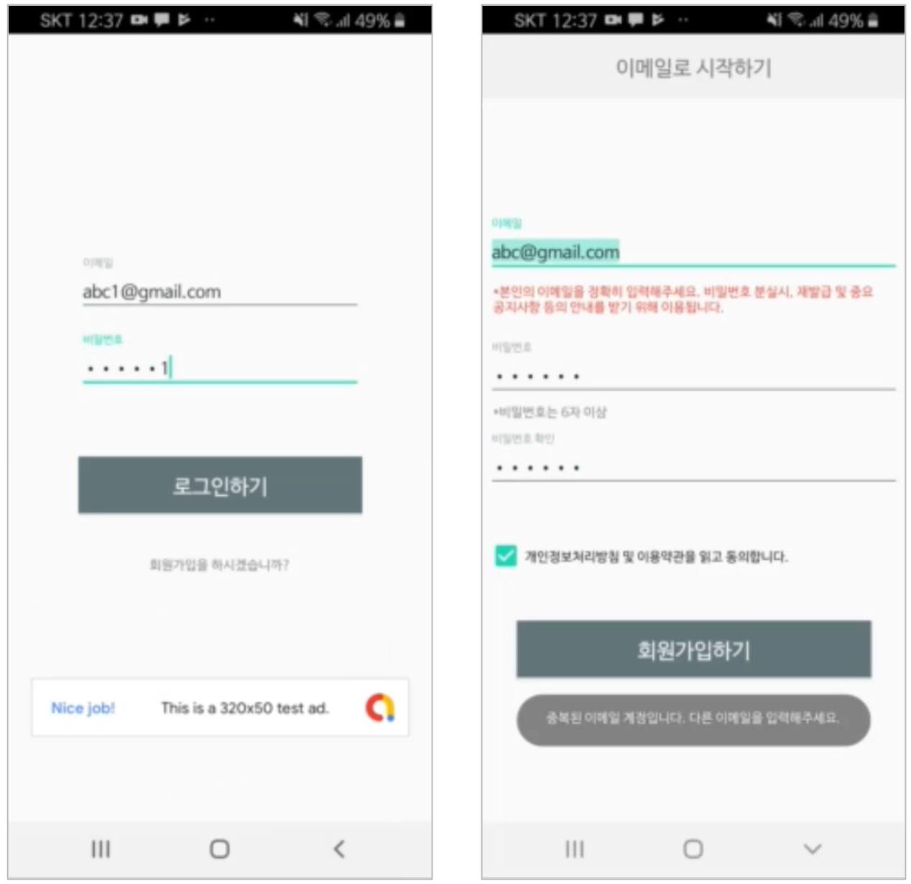
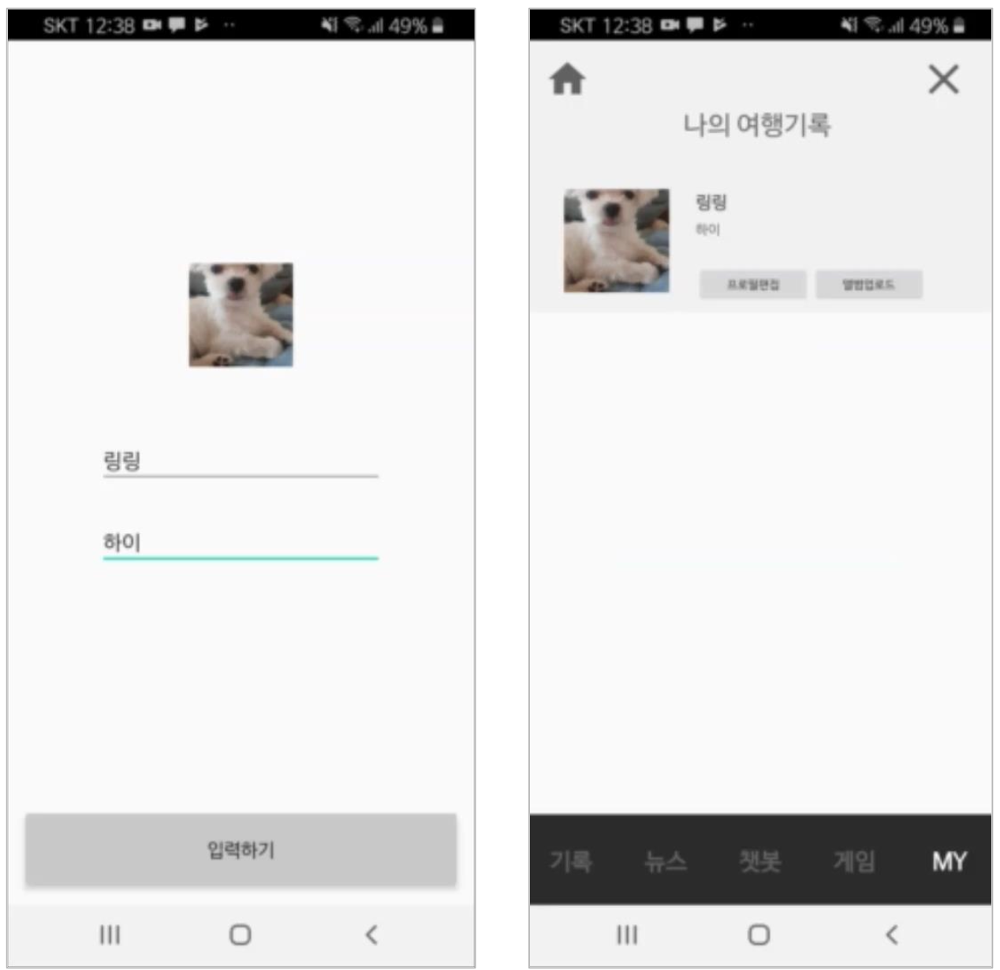

### SW 개발 개인 프로젝트

# 여기(여행기록)

## 소개

- 개발기간 : 4주 (기여도 100%)
- ‘여기(여행기록)’는 처음 안드로이드를 공부하기 위해 만들어봤던 작품입니다.
  여행 사진을 올리고, 공유할 수 있고, 미니게임을 하거나 뉴스를 검색할 수 있는 어플리케이션입니다.
- [시연 영상 보기](https://youtu.be/MgRPSSRxLHo) 👀

## 구현기술

- 기술스택 : Java
- 운영체제 : Android OS
- 프로토콜 : HTTP
- API/라이브러리 : OkHttp, HttpURLConnection, Glide, Android- SpinKit, OpenWeatherMap API, SimSimi API, Naver news API, 부트페이 API, Google AdMob, Gson

## 기능

### 1. 사진 올리기 & 공개 설정

### 2. 현재 날씨 및 관심 키워드 뉴스 보기

### 3. 게임 & 결제(개발자후원) & 심심이 채팅

### 4. 회원가입 & 로그인 & 구글 광고 배너

### 5. 프로필 설정

